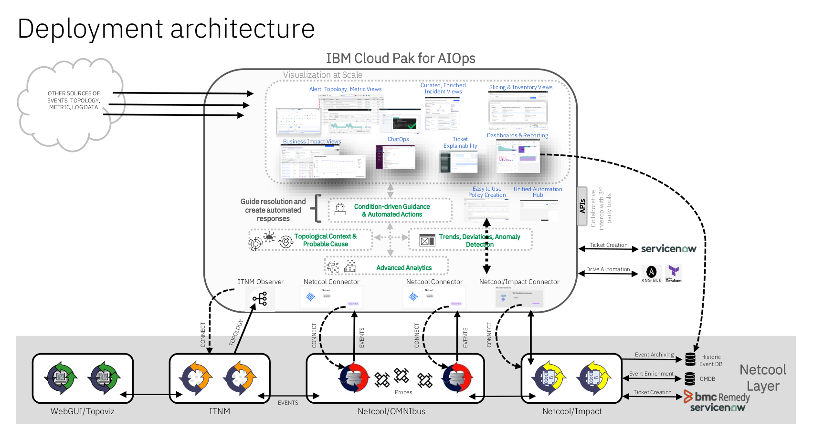

Coined by Gartner, AIOps—i.e. artificial intelligence for IT operations—is the application of artificial intelligence (AI) capabilities, 
such as natural language processing and machine learning models, to automate and streamline operational workflows.
The IBM Cloud Pak for AIOps is an AIOps platform that deploys advanced, explainable AI using the IT Operations 
(ITOps) toolchain data so that you can confidently assess, diagnose, and resolve incidents across mission-critical workloads.

IBM Cloud Pak for AIOps eases the path to adopting advanced AI for ITOps to decrease your operational 
costs. You can increase your customer satisfaction by proactively avoiding incidents and 
accelerating your time to resolution.

By integrating multiple separate, manual IT operations tools with into a single, intelligent, and automated IT 
operations platform, AIOps enables IT operations teams to respond more quickly—even proactively—to slowdowns and outages, 
with end-to-end visibility and context. It bridges the gap between an increasingly diverse, dynamic, and difficult to monitor 
IT landscape and siloed teams, on the one hand, and user expectations for little or no interruption in application performance and availability, on the other. 

After a successful installation of the IBM Cloud Pak for AIOps, a common task will be to integrate an existing Netcool deployment into AIOps.
AIOps will sit on top of an existing Netcool deployment, using Netcool/OMNIbus as an event source, and Netcool/Impact as an automation and integration engine. While some functions will be reimplemented in AIOps, many can remain in the Netcool layer, for example, event enrichment or ticketing integrations.

### Lab Content

Welcome to the Netcool + Cloud Pak for AIOps Lab. You will be going through several exercises that will help 
you learn key skills around how to add advanced AIOps capabilities to an existing Netcool OMNIbus deployment.

In this Lab, we will explore the following topics:

- Set up the Netcool Connector to connect to an existing ObjectServer
- Set up the Netcool/Impact Connector to connect to an existing Netcool/Impact server
- Set up an AIOps event housekeeping automation using Netcool/Impact
- Create a right-click tool in AIOps that calls a Netcool/Impact policy
- Migrate a custom correlation from Netcool to AIOps

The lab should be executed in the numbered order that you see on the left side of the screen in the navigation pane as each section depend on work completed in prior sections.