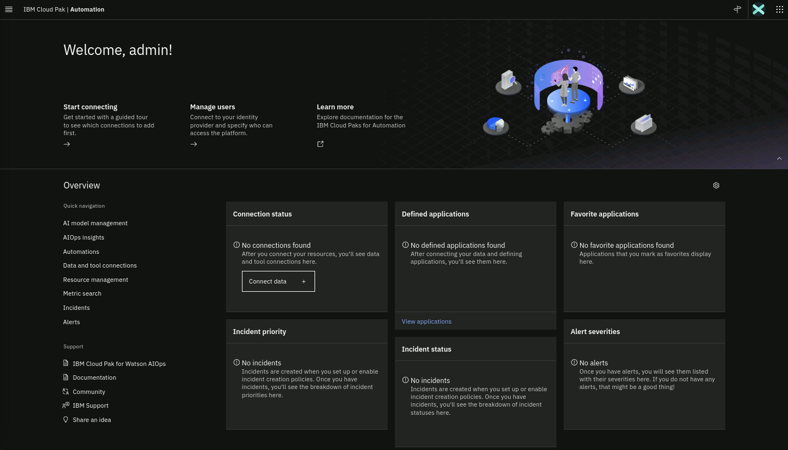

In this Lab, you will have access to one OpenShift cluster via a bastion virtual
machine that has installed Red Hat Enterprise Linux (RHEL). Note that inside
OpenShift, the cluster has installed the Red Hat OpenShift Data Foundation (ODF) which is a
software-defined, container-native storage solution that provides storage
classes that will be used by the Cloud Pak for AIOps to dynamically request
storage.

The following diagram describes the infrastructure for the Lab:


:::note

There is also a regular virtual machine present that has Netcool/OMNIbus and
Netcool/Impact installed. A Simnet Probe is running and feeding a stream of
events into Netcool/OMNIbus. The Netcool assets on this virtual machine will be
used in this lab.

:::


## 2.5: Log in to the Cloud Pak for AIOps console

Now you are going to locate the console URL and the admin login credentials from
your deployed instance of the Cloud Pak for AIOps.

Find the **Cloud Pak for AIOps URL** to access the console by running the
following command from the **Terminal** window:

```
echo -e "https://$(oc get route -n cp4waiops cpd -o jsonpath='{.spec.host}')\n"
```

Find the **password** for the **admin** username by running the following
command from the **Terminal** window:

```
oc -n cp4waiops get secret platform-auth-idp-credentials -o jsonpath='{.data.admin_password}' | base64 -d ; echo -e "\n"
```

Open a Firefox browser window and navigate to the AIOps dashboard using the url
you discovered in the previous step.

`https://cpd-cp4waiops.apps.ocp.techzone.lan`

:::tip

You will get one or more security **Warning: Potential Security Risk Ahead**.
This is because we have used self-signed certificates for this Lab. Just accept
the risk and continue.

:::

- Username: `cpadmin`
- Password: The password you found in the previous step.


After you login, you will land into the Cloud Pak for AIOps home page as shown
below:


